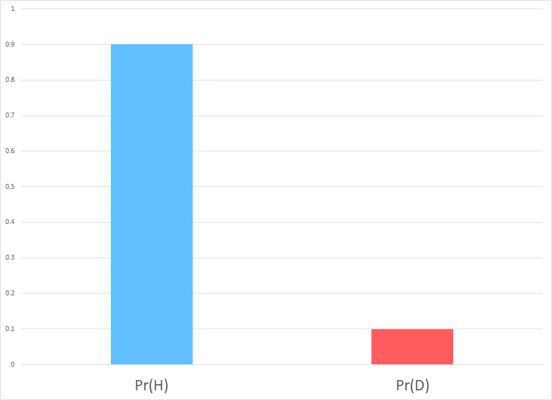
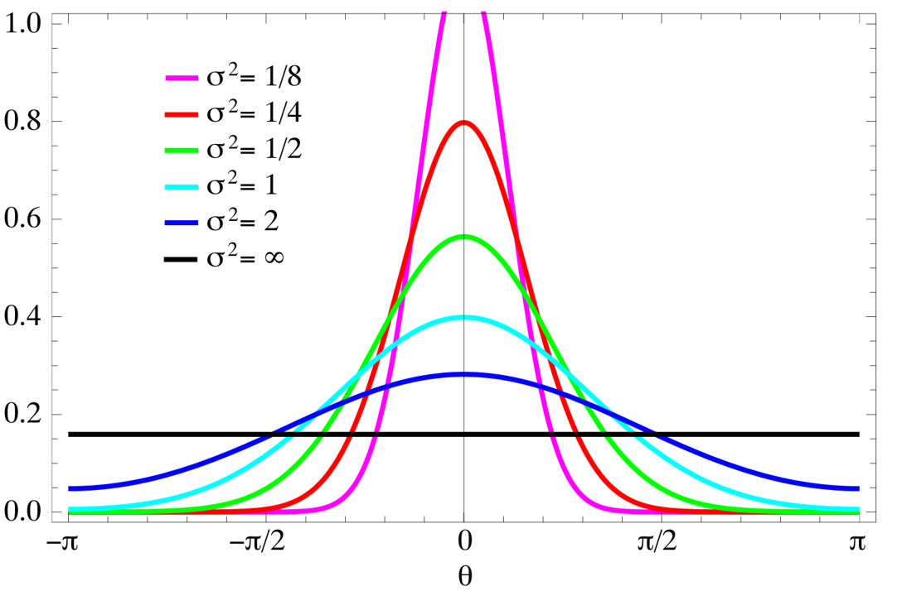

Inspired by a lecture of <a href="https://www.cns.nyu.edu/malab/">Prof. Wei Ji Ma </a>, I wrote this introduction to Bayesian updating. (Behavioral Theory, Fall 2019). 

## What you know already about Bayes' rule

Bayes' Theorem shows the relationship between a conditional probability and its counterpart.
Consider two events  $A $ and $ B $, Bayes' theorem states that, if $ P(B) \ne 0 $,  
$$ 
P(A \mid B)  = \frac{P(B \mid A) P(A)}{P(B)}.
$$
-	$ P(A) $ and $ P(B) $ are the probabilities of observing $  A $ and $ B  $.
- $ P(A \mid B) $ is a conditional probability: the probability of event $ A $ occurring given that $ B  $ occurs.
- $ P(B\mid A) $ is also a conditional probability: the probability of event $ B $ occurring given that $ A $ occurs.

### Warm-up Exercise
You come back from a vacation in an exotic place. You decide to go to the doctor to get tested for a disease common in that exotic area. But you know that medical results are not always accurate. Given the positive test result, what is the probability that you actually have this disease?

To formalize, denote the event that a patient has the disease as $D$ and the event the patient is healthy as $H$; let the event that the test turned out positive $+$ or negative $-$ for the disease. Bayes' Theorem helps you to compute the probability $ \Pr(D \mid +) $ given some other information:
To determine the answer to this question you need to know: (i) incidence of the disease, that is the \emph{prior} probability of the disease in the population, $ \Pr(D)$ ; (ii) test accuracy:

- probability of a false positive, $ \Pr(+ \mid H)$: how often does it report a positive result for someone without the disease?
- probability of a false negative, $ \Pr(- \mid D)$: how often does the test report a negative result for a sick patient?

Assume $ \Pr(D) = 10\\%, \Pr(+ \mid H) = 5\\%, $ and $ \Pr(- \mid D) = 20\\% $.

(a) Draw in the figure the probabilities.

 <i> solution  </i> 

    

        
        
Priors

    

    

        
        
Test Accuracy

    

 

How do you calculate the *posterior* probability of having the disease given a positive result of the test? Use Bayes' Theorem: $ \Pr(D \mid + ) = \frac{\Pr(+ \mid D) \Pr(D)}{\Pr(+)} $!

First, we determine the overall probability of a positive result (the denominator).  To do so, we use the Law of Total Probability:  for every event $ A $ and finite set of events $ B_n $, $ \Pr(A)  = \sum_n \Pr (A \cap B_n) = \sum_n \Pr(A \mid B_n) \Pr(B_n)$. 

(b) Calculate the probability of a positive result and the probability of a negative result.

 <i> solution  </i> 

Use the Total Law of Probability: $	 P(+) = P(+ \mid H) P(H) + P(+ \mid D) P(D) = 5\\%  \times 90\\% + 80\\% \times 10\\%  = 12.5\\%. $  Then,  $ \ P(-)  = 1 - 12.5\\% = 87.5\\% $. 

 
You are ready to calculate the posterior probabilities.

(c) Calculate the probability of being sick once observed a positive result, $ P(D \mid +) $.

 <i> solution  </i> 

$$ \Pr(D \mid + )	= \frac{P(+ \mid D)  P(D)}{P(+)} = \frac{80\\% \times 10\\%}{12.5\\%} = 64\\% $$
There is a 64% chance that someone with a positive test is actually sick.

 

(d) Which other probabilities can you recover from this? Which one you need to calculate by Bayes' Rule?

 <i> solution  </i> 

We can directly recover $\Pr(H \mid +) = 1- \Pr(D \mid + ) = 36\\%.$ One need to calculate the conditional probability on a negative test by Bayes' Rule.

 

(e) Calculate the remaining conditional probabilities 

 <i style=";color: rgba(255,255,255,0.54)"> solution  </i> 

$$ \Pr(D \mid - ) = \frac{\Pr(- \mid D) \Pr(D)}{\Pr(-)} = \frac{20\\% \times 10\\%}{ 87.5\\% } = 2.3\\% \\
\Pr(H \mid -)  = 1 - 2.3\\% =  97.7 $$

To summarize:

<table class="tg">
  <tr>
    <th class="tg-0pky">Posterior</th>
    <th class="tg-0pky">Negative</th>
    <th class="tg-0pky">Positive</th>
  </tr>
  <tr>
    <td class="tg-0pky">Healthy</td>
    <td class="tg-0pky">97.7%</td>
    <td class="tg-0pky">36%</td>
  </tr>
  <tr>
    <td class="tg-0pky">Disease</td>
    <td class="tg-0pky">2.3%</td>
    <td class="tg-0pky">64%</td>
  </tr>
</table>

 

(f) In the figure 
<a href="https://seeing-theory.brown.edu/bayesian-inference/index.html"> (source) </a> assign the following label to the appropriate quantities: priors, test accuracy, probability of the results, and posteriors.

 <i> solution  </i> 

-  Priors, $ \Pr(D) $ and $ \Pr(H) $: respectively, red dots and blue dots in the population;
- Test accuracy, $ \Pr(+ \mid H) $ and $ \Pr(- \mid H) $: respectively, blue bar and red bar in the test line;
- Probability of result, $ \Pr(+) $ and $ \Pr(-) $: respectively, all dots in the right column and all dots in the left column;
- Posteriors:
  -  $ \Pr(D \mid + ) $: all red dots in the right column;
  -  $ \Pr(H \mid + ) $: all blue  dots in the right column;
  -  $ \Pr(D \mid - ) $: all red dots in the left column;
  - $ \Pr(H \mid - ) $: all blue  dots in the left column.

 

----
## More on Bayes' Theorem

One of the most important application of Bayes' Theorem is inference: it allows us to put probability values on unknown parameter. Consider a random variable $x$ which is distributed conditional on an unknown parameter $ \theta \in \Theta $. You  observe some realizations $ x_{obs} $. Using these observations, we are interested in learning more about the true value of $ \theta $. One interpretation is that this information tells you something about the model behind  data.

To make this inference, you need to start from a *prior distribution* on the unknown parameter $\theta$, that is $ \Pr(\theta) $ for each value $ \theta \in \Theta $. This summarize the observer's available information (or lack of information) about the parameter. Moreover, you need a *likelihood function* that tells you how to interpret the observations, absent prior knowledge.  Formally, it is equal to the probability of the observed data under a parameter realization: $ \Pr (x  \mid \theta ).$ 

        
        
Example of conditional distribution

However, since the parameter is unknown and we can fix $ x $ using $ x_{obs} $, we treat the likelihood as a function of $ \theta $: it expresses the plausibility of different parameter values for a given sample of data. A Bayesian observer computes a posterior distribution of $ \theta  $ given the observed value. In general, the posterior $\Pr(\theta \mid x_{obs})$ is the probability density function over the unknown $\theta$ given the observations $x_{obs}$, calculated by Bayes' rule as
$$ \Pr(\theta  \mid x_{obs}) = \frac{ \Pr (x_{obs} \mid \theta)\Pr(\theta)}{\Pr(x_{obs})} $$

Bayes' Theorem updates the information on $\theta$ by extracting the information on $\theta$ contained in the observation $x_{obs}$. So we can use this result to choose the best among a set of hypotheses as follows: each possible value of the parameter is a hypothesis, and the likelihood of that  is the observer's belief that the observations would arise under that hypothesis; priors and posteriors are both belief distributions whose arguments are hypothesis; we should select the hypothesis with the highest posterior to make our choices.

Last, it is very useful to note that the posterior is proportional to the product of prior and likelihood (denominator is a normalization factor independent of $\theta$):
$$ \Pr(\theta  \mid x_{obs}) \propto \Pr (x_{obs} \mid \theta)\Pr(\theta). $$
 

 Go back to point (a) of the previous exercise. Draw the four products of prior and  likelihood and check that it is suggestive of the final posterior.

 <i> solution  </i> 

 

---
### Exercise: Competing hypotheses 

You observe bouncy balls all moving downward. You only consider two possible scenarios:
- **Scenario 1:** all balls are part of the same object, thus they always move together. They move together either up or down, each with probability 0.5.
- **Scenario 2:** Each ball is an object by itself and independently moves either up or down, each with probability 0.5.

Considering only four bouncy balls, you want to learn which of the following story is true. Note that in this example you only care about direction, whereas speed and position do not play a role in this problem. 

#### Likelihoods
The likelihood of a scenario is the probability of the observations under that scenario: $ \Pr( obs \mid Scenario ).$

(a) What is the likelihood of Scenario 1?

 <i> solution  </i> 

$\Pr(obs \mid Scenario 1) = 0.5 = 1/2.$

 

(b) What is the likelihood of Scenario 2?

 <i> solution  </i> 

$ \Pr(obs \mid Scenario 2) = (0.5)^{4} = 1/16.$

 

(c) Do the likelihoods of the scenarios sum to one?

 <i> solution  </i> 

No, there is no law of probability that says that probabilities of same observations under different scenarios sum up to one.

 

(d) What is wrong with the phrase "the likelihood of the observations"?

 <i> solution  </i> 

One cannot speak about the likelihood of something without an considering a scenario to condition on. Remember that a likelihood is a conditional probability.

 

#### Priors
In many applications of interest, priors are not well-defined. In this examples, assume that Scenario 1 occurs twice as often as Scenario 2. You can use these frequencies of occurrence as prior probabilities, reflecting expectations in the absence of specific observations.

(e) What are the prior probabilities of Scenario 1 and 2?

 <i> solution  </i> 

$\Pr(Scenario 1) = 2/3, \quad \Pr(Scenario 2)= 1/3. $

 

#### Normalization Factor
As an intermediate step, you need to calculate the product of the likelihood of a scenario multiplied by its prior probability: $ \Pr(obs \mid Scenario) \times \Pr(Scenario).$

These are used to calculate the numerator in Bayes' rule.

(f) Calculate this product for Scenario 1 and 2?

 <i> solution  </i> 

$ \Pr(obs \mid Scenario 1) \times \Pr(Scenario1 ) &= 2/3 \times 1/2 = 1/3$

$ \Pr(obs \mid Scenario 2) \times \Pr(Scenario2 ) & = 1/3 \times 1/16 = 1/48$

 

(g) Sum the two products. Is it equal to one?

 <i> solution  </i> 

No: $ \quad  \Pr(obs \mid Scenario 1) \times \Pr(Scenario1 ) +  \Pr(obs \mid Scenario 2) \times \Pr(Scenario2 ) = 1/3 + 1/48 = 17/48 $.

 

The normalization factor in Bayes' Rule is the overall probability of the observations and it is sum of the two products, as calculated above. This is because posteriors have to sum up to one.

#### Posteriors

(h) Divide the product of prior and likelihood by the normalization factor for each scenario

 <i> solution  </i> 

$$	\Pr(Scenario 1 \mid obs) = \frac{\Pr(obs \mid Scenario 1) \times \Pr(Scenario1 ) }{\Pr(obs \mid Scenario 1) \times \Pr(Scenario1 )  + \Pr(obs \mid Scenario 2) \times \Pr(Scenario2 )} 
	 = \frac{1/3}{17/48}=\frac{1}{3} \times \frac{48}{17}=  \frac{16}{17}. $$

$$ \Pr(Scenario 2 \mid obs) = \frac{\Pr(obs \mid Scenario 2) \times \Pr(Scenario 2 ) }{\Pr(obs \mid Scenario 1) \times \Pr(Scenario1 )  + \Pr(obs \mid Scenario 2) \times \Pr(Scenario2 )} = \frac{1/48}{17/48}= \frac{1}{48} \times \frac{48}{17}= \frac{1}{17}.$$

 

You have just applied Bayes' rule to obtain the posteriors for each scenario. Now you want to pick scenario with the highest posterior.

(i) Which scenario has the highest posterior?

 <i> solution  </i> 

Scenario 1 is more likely given our observations. 
Indeed, the brain has a tendency to group the dots together because of their common motion, and perceive them as a single object. This is called <a href="https://en.wikipedia.org/wiki/Gestalt_psychology#Law_of_Common_Fate">Gestalt principle of common fate</a>. 

You have just explained a well-known phenomena by Bayes inference! 

 

---

### Exercise: Multiple Inputs

Consider the following model: your utility of breakfast is given by the product of quality coffee and the quality of the cake you consume:
$$ U(\mbox{breakfast})= \mbox{quality of cake} \times \mbox{quality of coffee}. $$
Assume that the quality is evaluated between 0 and 1. 

This morning you had a very bad breakfast, with utility of breakfast today 0.2. You want to understand the cause of that. You are better at assessing separately the quality of coffee, but not the quality of cake.

(a) Suppose further that you hypothesized the quality of the coffee to be 1 (very good coffee). Under this hypothesis, calculate what the quality of the cake must have been.

 <i> solution  </i> 

$$ \underbrace{U(\mbox{breakfast})}_{0.2} = \mbox{quality of cake} \times \underbrace{\mbox{quality of coffee}}_1 $$

So the quality of cake must have been 0.2.

 

(b) What if you suppose that  the quality of coffee to be 0.4?

 <i> solution  </i> 

$$ \underbrace{U(\mbox{breakfast})}_{0.2} = \mbox{quality of cake} \times \underbrace{\mbox{quality of coffee}}_{0.4}$$

So the quality of cake must have been 0.5.

 

(c) Why utility of breakfast provides ambiguous information about quality of the cake?

 <i> solution  </i> 

Because quality of coffee modulates the utility of breakfast together with the quality of cake and you do not have accurate information on that.

 

(d) By going through a few more examples like the ones in (a) and (b), draw on the two-variable likelihood diagram all combinations of hypothesized  quality of coffee and hypothesized quality of cake that could have produced the utility of breakfast equal to 0.2. 

 <i> solution  </i> 

 

(e) Suppose that you have a strong prior that quality of coffee is uniformly distributed between 0.2 and 0.4 for sure. In the two-variable prior diagram, shade the area corresponding to the support of the prior.

 <i> solution  </i> 

 

(f) Can we infer something about the quality of cake? Finally draw where the posterior probability is high. 

 <i> solution  </i> 

You can just restricted your posterior. If you believe that the quality of coffee is between 0.2 and 0.5, it means that the quality of cake was above 0.5: the cake was good!

 

----
## Puzzle: Monty Hall Paradox

You're on a TV show. You're given the choice of three doors: behind one door is a car (prize); behind the others, goats (non-prize). Which one would you pick? Suppose you pick door No.1. Now the host, who knows what's behind the doors, does not open the one you selected but opens another door, say No. 3, which has a goat. Then the host says to you, ``Do you want to pick door No. 2?" 

<a href="https://www.youtube.com/watch?v=cXqDIFUB7YU">Does it matter if you switch?</a> Yes! This is a famous counter-intuitive problem. Let's use Bayes' Rule to solve it.

Denote the event "door $ i $ hides a car" with $ C_i $.

(a)
When the host of the TV show gives you the choice to pick a door, what is your prior probability of finding the car behind each door?

 <i> solution  </i> 

Since you do not have any information, you believe each door is equally likely to hide the car:
$ \Pr(C_1) = \Pr(C_2) = \Pr(C_3) = \frac{1}{3}.$

 

Denote the event "door $ i $ is chosen by the guest" with $ X_i $ and the event "door $ i $  is opened" with $ O_i $. Your priors are unchanged after the host opens a door, by independence between the event $ C_i $ and $ X_i $ (the player doesn't know where is the car in order to make a choice). This implies that $ \Pr(C_i, X_i)  = \Pr(C_i) \times \Pr(X_i)$. 

Initially you have chosen door No. 1. Now the host will open a door that does not hide the car.

(b) What is the probability that the host will open door No. 3 in the following cases?

 <i> solution  </i> 

- The car is behind door No. 1: $ \Pr(O_3 \mid X_1, C_1) = \frac{1}{2}.$
- The car is behind door No. 2: $ \Pr(O_3 \mid X_1, C_2) = 1.$
- The car is behind door No. 3: $ \Pr(O_3 \mid X_1, C_3) = 0.$

 

(c) What is the overall probability that the host will open door no.3?

 <i> solution  </i> 

Using total law of probability:
$$ 	\Pr(O_3 \mid X_1) = \Pr(O_3 \mid X_1, C_1) \times \Pr(C_1) + \Pr(O_3 \mid X_1, C_2) \times \Pr(C_2) + \Pr(O_3 \mid X_1, C_3) \times \Pr(C_3) = \frac{1}{2} \times \frac{1}{3} + 1 \times \frac{1}{3} + 0 \times \frac{1}{3} = \frac{1}{2}.$$
				

 
The host opens door No.3. Now we know that $ \Pr(C_3 \mid 0_3) = 0 $ (posterior probability).

(d) Use Bayes' rule to calculate the conditional probability that the car is behind the door you chose, given  that door No.3 was open: $ \Pr(C_1 \mid X_1, O_3) $. 

 <i> solution  </i> 

$$\Pr(C_1 \mid X_1, O_3) = \frac{\Pr(O_3 \mid X_1, C_1) \times \Pr(C_1, X_1)}{\Pr(X_1, O_3)}  = \frac{\Pr(O_3 \mid X_1, C_1) \times \Pr(C_1) \times \Pr(X_1)}{\Pr(O_3 \mid X_1)\times \Pr(X_1)}  = \frac{1/2 \times 1/3 \times 1}{1/2 \times 1} = \frac{1}{3} $$

 

(e) Calculate the conditional probability that the car is behind the other door.

 <i> solution  </i> 

This is just the complement of $\Pr(C_2 \mid X_1, O_3)  $, since door No.3 was open.

$$\Pr(C_2 \mid X_1, O_3) = 1- \Pr(C_2 \mid X_1, O_3) = \frac{2}{3} $$

 

(f) Should you switch door?

 <i> solution  </i> 

Yes!

 
